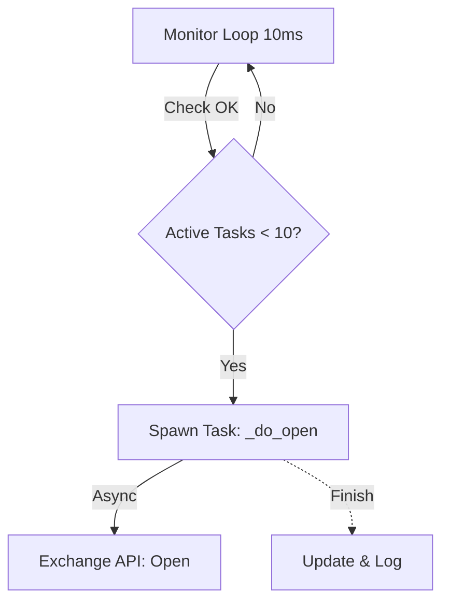

# 🚀 交易执行逻辑详解 (v2.0)

本文档详细说明了经过优化的“开仓”与“清仓”执行原理。

## 1. 自动开仓 (Machine Gun Mode) 🔫

**特点**：独立并发，发后不管，极速响应。

### 执行流程
1. **Monitor Loop (每10ms)**: 监控器巡检所有卡片。
2. **条件检查**: 
   - `价差 >= 开仓阈值` (e.g. -0.5%)
   - 且 `当前持仓 < 最大持仓`
   - 且 `当前活跃任务数 < 10` (系统负载允许)
3. **触发动作**:
   - 立即启动一个独立的 `_do_open` 任务 (Fire-and-Forget)。
   - **关键点**：监控器**不等待**该任务完成，立即进行下一次检查。
4. **并发效果**:
   - 只要条件一直满足，监控器会极其快速地连续发射开仓指令 (Task 1, Task 2, Task 3...)，直到达到并发上限 (10) 或仓位上限。
   - 就像机关枪连续射击，利用 Monitor 的高频检查来制造高并发。



## 2. 自动清仓 (Sliding Window Pipeline) 🌊

**特点**：滑动窗口，流水线作业，拒绝等待，实时反馈。

### 执行流程
1. **触发**: 
   - `价差 <= 清仓阈值` (e.g. 0.5%)
   - 且 `持仓 > 0`
   - 且 `没有正在进行的清仓任务`
2. **启动**: 启动唯一的 `_do_close` 任务接管该卡片。
3. **滑动窗口 (Sliding Window)**:
   - **初始化**: 准备 5 个并发槽位 (Slots)。
   - **填充 (Fill)**: 只要有空槽位且还有余额，立即创建平仓子任务填满槽位。
   - **等待 (Wait)**: 使用 `FIRST_COMPLETED` 机制等待。这是与旧版（Batch）最大的区别。
     - **旧模式 (Batch)**: 发5个 -> 等待5个全回来 -> 发下一批。哪怕前4个都在0.1秒完成了，也要等第5个慢的（比如3秒），导致中间有空档。
     - **新模式 (Window)**: **只要有 1 个任务完成**，系统立即醒来。
   - **循环 (Loop)**: 腾出槽位后，立即启动下一个子任务填补。这就形成了一个连续不断的“请求流水线”。
4. **实时反馈**:
   - 每完成一个子任务 (0.x秒)，立即更新内存仓位并广播给前端。
   - 前端数字实时跳动，不再像以前那样卡顿几秒直到一批结束。

```mermaid
graph LR
    subgraph Monitor Execution
    A[Start Close] --> B{Remaining > 0?}
    B -->|Yes| C[Fill Empty Slots (Max 5)]
    C --> D[Wait for FIRST_COMPLETED]
    D -->|Task Done| E[Update Memory & Broadcast]
    E --> B
    end
```

## 3. 安全风控 🛡️

为了支撑上述高并发，我们配置了三重风控：

- **1. 预扣减 (Pre-Deduction)**: 
  - 无论是开仓还是平仓，在发单前先在内存中扣减额度。只有余额足够才允许发单，从源头防止本地多发。
- **2. 交易所防线 (Exchange Guard)**: 
  - **Bybit**: 强制开启 `reduceOnly=True`，只减仓不加仓。
  - **Binance**: 利用 Hedge Mode 机制，平仓量溢出会自动拒单。
- **3. 令牌桶限流 (Token Bucket)**: 
  - 底层 `ExchangeClient` 严格限制每分钟 API 调用次数 (1000次/分)。无论上层逻辑多快，一旦触及频率红线，会自动暂停等待，确保账户绝不被封禁。
